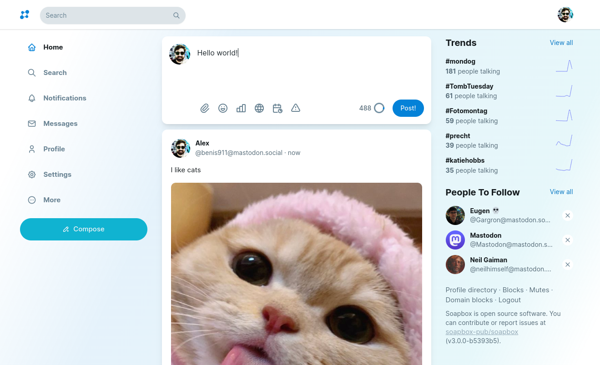

**Soapbox** is customizable open-source software that puts the power of social media in the hands of the people. Feature-rich and hyper-focused on providing a user experience to rival Big Tech, Soapbox is already home to some of the biggest alternative social platforms.

# On The Fediverse

You may have heard of **Mastodon**. Soapbox builds upon what Mastodon made great to make something even better.

You can run **Mastodon+Soapbox**, **Rebased+Soapbox**, and more.

Soapbox is the **frontend** (what users see) while Mastodon is the **backend** (data, APIs). You can mix-and-match in the Fediverse ecosystem.

> 💡 If you're starting a new server, we highly recommend **Rebased+Soapbox**. Rebased is our custom-built backend just for Soapbox, providing important new features such as **quote posting** and **chats**.
>
> See: [Installing Rebased+Soapbox](https://soapbox.pub/install/)

# Try It Out

Want to give Soapbox a shot? Here are some suggested servers:

- [gleasonator.com](https://gleasonator.com/) - operated by the lead developer of Soapbox
- [social.teci.world](https://social.teci.world/) - free speech server run by a Soapbox contributor
- [spinster.xyz](https://spinster.xyz/) - one of the largest feminist communities on the internet
- [poa.st](https://poa.st/) - the largest Soapbox server on the network

Want to use Soapbox against **any existing Mastodon/Pleroma server?** Try:

- [fe.soapbox.pub](https://fe.soapbox.pub) - enter your server's domain name to use Soapbox on any server!

# 🚀 Starting Your Own Server

Starting your own server is one of the best ways to have freedom online! We recommend installing **Rebased+Soapbox**.

See here for a detailed setup guide: [Installing Rebased+Soapbox](https://soapbox.pub/install/)

# Adding Soapbox to an Existing Server

Already have a server? No problem — it is still possible to use Soapbox.

- [Deploying on Pleroma](https://docs.soapbox.pub/frontend/installing/#install-soapbox)
- [Deploying on Mastodon](https://docs.soapbox.pub/frontend/administration/mastodon/)

> 💡 If using Pleroma, it's recommended to [upgrade it to Rebased](https://gitlab.com/-/snippets/2411739). This comes with better support and many new features, helping you get the most out of Soapbox.

# Developing Soapbox

tl;dr — `git clone`, `yarn`, and `yarn dev`.

For detailed guides, see these pages:

1. [Soapbox local development](https://docs.soapbox.pub/frontend/development/running-locally/)
2. [yarn commands](https://docs.soapbox.pub/frontend/development/yarn-commands/)
3. [How it works](https://docs.soapbox.pub/frontend/development/how-it-works/)
4. [Environment variables](https://docs.soapbox.pub/frontend/development/local-config/)
5. [Developing a backend](https://docs.soapbox.pub/frontend/development/developing-backend/)

## Contributing

We welcome contributions to this project.
To contribute, see [Contributing to Soapbox](docs/contributing.md).

Translators can help by providing [translations through Weblate](https://hosted.weblate.org/projects/soapbox-pub/soapbox/).
Native speakers from all around the world are welcome!

# Project Philosophy

Soapbox was born out of the need to build independent platforms with **a unique identity and brand**.

This is in contrast to Mastodon's idea, where all servers are called "Mastodon" and use the Mastodon colors and logo. Users won't see the word "Soapbox" throughout the UI, they'll see the name of **your website** and your logo. To facilitate this, Soapbox has a robust customization UI and integrated moderation tools. Large servers are a priority.

One disadvantage of this approach is that it does not help the software spread. Some of the biggest servers on the network and running Soapbox and people don't even know it!

# License & Credits

© Alex Gleason & other Soapbox contributors  
© Eugen Rochko & other Mastodon contributors  
© Trump Media & Technology Group  
© Gab AI, Inc.

Soapbox is free software: you can redistribute it and/or modify
it under the terms of the GNU Affero General Public License as published by
the Free Software Foundation, either version 3 of the License, or
(at your option) any later version.

Soapbox is distributed in the hope that it will be useful,
but WITHOUT ANY WARRANTY; without even the implied warranty of
MERCHANTABILITY or FITNESS FOR A PARTICULAR PURPOSE. See the
GNU Affero General Public License for more details.

You should have received a copy of the GNU Affero General Public License
along with Soapbox. If not, see <https://www.gnu.org/licenses/>.
