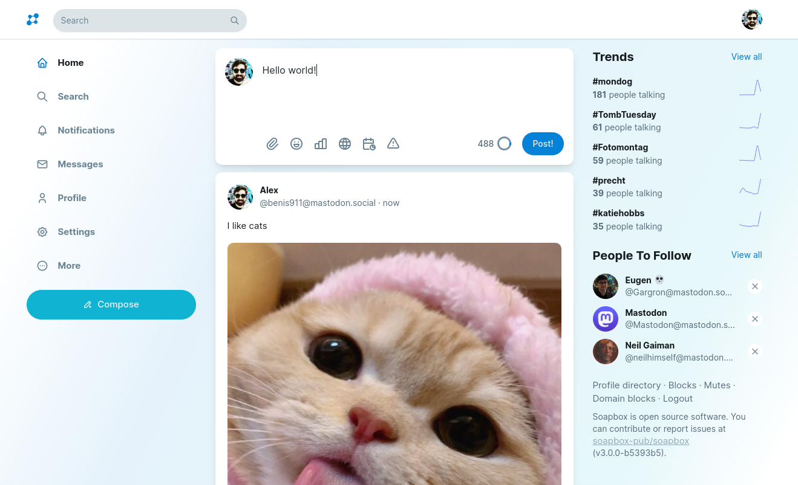

# Soapbox FE

**Soapbox FE** is the original Soapbox: a social media frontend for the Fediverse with a focus on custom branding and ease of use.

> ℹ️ Soapbox FE has been superseded by **[Ditto](https://soapbox.pub/ditto)**. New projects should look there first. Soapbox FE remains available for people who want a classic Fediverse frontend for their Mastodon or Pleroma server.

# History

Soapbox FE started out in 2020 as an alternative frontend for **Pleroma**, built on Gab Social's frontend, which was in turn built on Mastodon's. Pleroma servers could swap it in for the default pleroma-fe, and it was later adapted to run on top of Mastodon as well.

Over time it grew into a standalone client. It learned to talk to most Mastodon-compatible backends (Mastodon, Pleroma, Akkoma, Rebased, GoToSocial, Friendica, Firefish, and others), and could be pointed at any server from the browser. At that point it was renamed from "Soapbox FE" to just "Soapbox".

Later it gained Nostr support to serve as the frontend for Ditto. Ditto has since been rewritten as a pure Nostr client, so that support was removed again, and the project is back to being what it started as: a Fediverse frontend. It's called Soapbox FE once more to tell it apart from Soapbox the organization and its other projects.

# Try It Out

- [fe.soapbox.pub](https://fe.soapbox.pub) - enter your server's domain name to use Soapbox FE on any Mastodon-compatible server.

# Installing

Soapbox FE is a static single-page application. You can host it anywhere, or install it on top of an existing server so it replaces the default frontend:

- [Deploying on Pleroma](https://docs.soapbox.pub/soapbox/install/pleroma/#install-soapbox)
- [Deploying on Mastodon](https://docs.soapbox.pub/soapbox/install/mastodon/)

# Developing

tl;dr — `git clone`, `yarn`, and `yarn dev`.

For detailed guides, see these pages:

1. [Local development](https://docs.soapbox.pub/soapbox/development/local/)
2. [yarn commands](https://docs.soapbox.pub/soapbox/development/yarn-commands/)
3. [How it works](https://docs.soapbox.pub/soapbox/development/how-it-works/)
4. [Build config](https://docs.soapbox.pub/soapbox/development/build-config/)

## Contributing

We welcome contributions to this project!

- [Making a Merge Request](https://docs.soapbox.pub/soapbox/contributing/)
- [Contributing Translations](https://docs.soapbox.pub/soapbox/translations/)

# Project Philosophy

Soapbox FE was born out of the need to build independent platforms with **a unique identity and brand**.

This is in contrast to Mastodon's idea, where all servers are called "Mastodon" and use the Mastodon colors and logo. Users won't see the word "Soapbox" throughout the UI, they'll see the name of **your website** and your logo. To facilitate this, Soapbox FE has a robust customization UI and integrated moderation tools.

# License & Credits

© Alex Gleason & other Soapbox contributors  
© Eugen Rochko & other Mastodon contributors  
© Trump Media & Technology Group  
© Gab AI, Inc.

Soapbox FE is free software: you can redistribute it and/or modify
it under the terms of the GNU Affero General Public License as published by
the Free Software Foundation, either version 3 of the License, or
(at your option) any later version.

Soapbox FE is distributed in the hope that it will be useful,
but WITHOUT ANY WARRANTY; without even the implied warranty of
MERCHANTABILITY or FITNESS FOR A PARTICULAR PURPOSE. See the
GNU Affero General Public License for more details.

You should have received a copy of the GNU Affero General Public License
along with Soapbox FE. If not, see <https://www.gnu.org/licenses/>.
